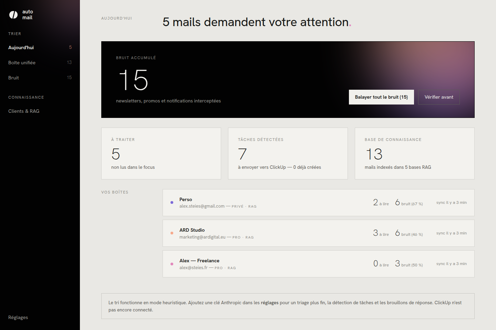

# Automail

**Vos boîtes mail, sans le bruit.**

Automail est une application auto-hébergée qui gère plusieurs boîtes mail (pro et privées) en même temps, filtre automatiquement le bruit — newsletters, promos, notifications — et construit une base de connaissance (RAG) par client pour répondre plus vite, avec tout le contexte.

Pensée pour rester simple à tenir au quotidien : un chiffre, un bouton, boîtes propres.



## Ce qu'elle fait

- **Multi-boîtes IMAP** — connectez autant de boîtes que vous voulez (pro ou privé), synchronisation automatique, tout arrive dans une boîte unifiée.
- **Filtre à bruit** — chaque mail entrant est trié : *focus* ou *bruit*. Le triage combine des règles apprises, des heuristiques locales (désabonnement, no-reply, plateformes marketing…) et une classification IA fine — par défaut via **votre abonnement Claude** (Claude Code en local, aucune clé requise), ou via une clé API.
- **Réversible, toujours** — un mail classé bruit se restaure en un clic ; un mail raté se marque en un clic. Chaque correction apprend une règle sur l'expéditeur : Automail ne refait pas deux fois la même erreur.
- **Balayage en masse** — le bouton « Balayer tout le bruit » supprime tout le bruit d'un coup (localement et sur le serveur IMAP : corbeille si elle existe, sinon suppression), par boîte ou toutes boîtes confondues.
- **Tâches ClickUp** — quand un mail contient une demande actionnable, Automail la détecte (titre, contexte, échéance) et la crée dans la liste ClickUp de votre choix en un clic.
- **Bases RAG par périmètre** — chaque boîte peut alimenter (ou non, c'est un interrupteur) la base de connaissance :
  - une **base privée** (vos boîtes perso opt-in),
  - une **base pro** (vos boîtes pro opt-in),
  - et une **base par client** : définissez un client avec ses domaines/adresses, tous ses mails sont automatiquement rattachés et indexés dans sa propre base.
- **Contexte au moment de répondre** — en ouvrant un mail, le panneau « Contexte » remonte l'historique pertinent (même client d'abord). Le brouillon IA s'appuie dessus : dates, engagements, budgets, tout y est.
- **Recherche dans la mémoire** — interrogez n'importe quelle base (« budget refonte », « deadline salon »…) depuis la page Clients & RAG.

Le bruit n'est jamais indexé dans le RAG. Un mail restauré y retourne automatiquement.

## Démarrer

```bash
npm install
npm run seed     # données de démonstration (3 boîtes, 3 clients, 28 mails)
npm run dev      # serveur (4870) + interface (5173)
```

Ouvrez http://localhost:5173 — l'app est immédiatement utilisable avec les données de démo.

En production :

```bash
npm run build
npm start        # sert l'interface et l'API sur http://localhost:4870
```

### Connecter vos vraies boîtes

Réglages → *Connecter une boîte* : serveur IMAP/SMTP, mot de passe (ou mot de passe d'application pour Gmail/iCloud), type pro/privé, et l'interrupteur « base RAG ». La synchronisation tourne ensuite toute seule (toutes les 3 min par défaut).

### Moteur IA — trois options (Réglages → Intelligence)

| Moteur | Ce qu'il faut | Coût |
|---|---|---|
| **Abonnement Claude** *(défaut)* | [Claude Code](https://code.claude.com) installé et connecté à votre compte (`claude` dans le terminal) | Inclus dans votre abonnement Claude Pro/Max — quota partagé avec claude.ai |
| Clé API Anthropic | `ANTHROPIC_API_KEY` (`.env` ou Réglages) | Facturation à l'usage |
| Heuristiques seules | Rien | Gratuit |

Par défaut, Automail passe par Claude Code en mode headless : le tri, la détection de tâches et les brouillons consomment votre abonnement, sans clé API. **Réservé à un usage personnel sur votre machine** (conditions Anthropic) — pour déployer l'app ailleurs ou pour plusieurs utilisateurs, passez à la clé API. Pour économiser le quota, les cas évidents (lien de désabonnement, no-reply, règles apprises) sont tranchés localement sans appel IA ; seuls les mails ambigus remontent à Claude. Si Claude Code est introuvable, Automail se replie automatiquement sur la clé API si elle existe, sinon sur les heuristiques.

### Autres réglages (`.env` ou Réglages)

Copiez `.env.example` vers `.env` :

| Variable | Rôle |
|---|---|
| `ANTHROPIC_API_KEY` | Moteur « clé API » (optionnel) |
| `CLICKUP_TOKEN` | Création de tâches ClickUp (jeton personnel) |
| `AUTOMAIL_SYNC_INTERVAL` | Intervalle de sync en secondes (défaut 180) |

**Sans abonnement ni clé, tout fonctionne** : le triage passe en mode heuristique + règles apprises, le RAG utilise un embedding local.

### Embeddings

Par défaut, Automail essaie un modèle multilingue local (`multilingual-e5-small` via `@xenova/transformers`, dépendance optionnelle — aucune donnée ne sort de chez vous). S'il n'est pas disponible, repli automatique sur un embedding par hachage, instantané et sans téléchargement.

## Architecture

```
server/            API Express + moteur (Node ≥ 20, ESM, SQLite)
  db.js            schéma + accès SQLite (better-sqlite3, mode WAL)
  imap.js          sync incrémentale (imapflow), suppression distante
  smtp.js          envoi des réponses (nodemailer)
  pipeline.js      client → triage → tâche → indexation RAG
  ai/heuristics.js triage local + règles apprises
  ai/claude.js     classification et brouillons (Anthropic, optionnel)
  ai/embeddings.js embeddings locaux + repli hashing
  ai/rag.js        index, recherche cosinus, portées private/pro/client
  clickup.js       API ClickUp v2
  routes.js        API REST
  seed.js          données de démonstration
web/               interface React + Vite (TypeScript)
```

Les mots de passe des boîtes restent dans la base SQLite locale (`data/automail.sqlite`) et ne sont jamais renvoyés par l'API.

## Design

L'interface suit la charte *alex steies v2* : papier `#E9E8E4`, encre `#141513`, noir écran `#020202`, Hanken Grotesk partout, chiffres en Thin 200, angles vifs — et l'aurora (`#F6A98C → #E289BC → #7B68D8`) uniquement en halo lumineux sur fond noir, jamais en aplat.
